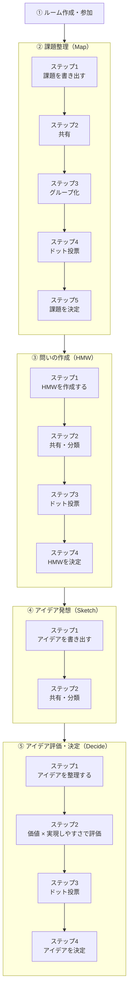

# デザインスプリント画面フロー

```mermaid
flowchart TD

A[① ルーム作成・参加]

A --> C

subgraph C["② 課題整理（Map）"]
direction TB
C1[ステップ1<br>課題を書き出す]
C2[ステップ2<br>共有]
C3[ステップ3<br>グループ化]
C4[ステップ4<br>ドット投票]
C5[ステップ5<br>課題を決定]

C1 --> C2 --> C3 --> C4 --> C5
end

C --> D

subgraph D["③ 問いの作成（HMW）"]
direction TB
D1[ステップ1<br>HMWを作成する]
D2[ステップ2<br>共有・分類]
D3[ステップ3<br>ドット投票]
D4[ステップ4<br>HMWを決定]

D1 --> D2 --> D3 --> D4
end

D --> E

subgraph E["④ アイデア発想（Sketch）"]
direction TB
E1[ステップ1<br>アイデアを書き出す]
E2[ステップ2<br>共有・分類]

E1 --> E2
end

E --> F

subgraph F["⑤ アイデア評価・決定（Decide）"]
direction TB
F1[ステップ1<br>アイデアを整理する]
F2[ステップ2<br>価値 × 実現しやすさで評価]
F3[ステップ3<br>ドット投票]
F4[ステップ4<br>アイデアを決定]

F1 --> F2 --> F3 --> F4
end
```
