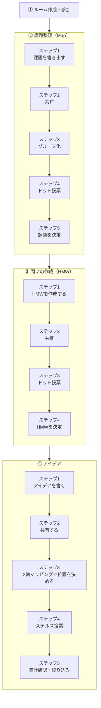
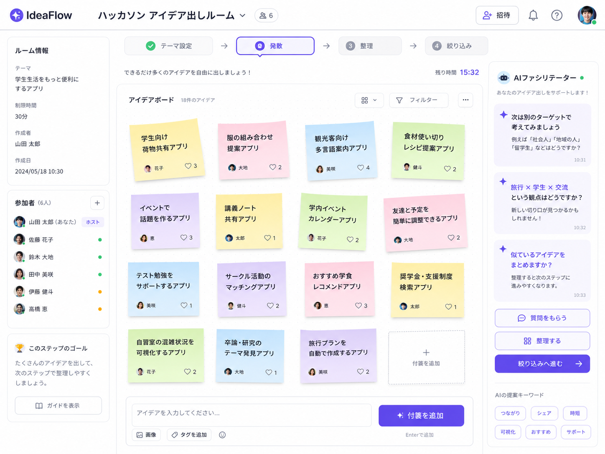

# PRD（IdeaFlow）

> チーム向けアイデア創出支援アプリ **IdeaFlow** のプロダクト要求仕様。
> MVP は **デザインスプリント形式**（課題整理 → 問いの作成 → アイデア決定）として具体化した。
> 本ドキュメントは Wiki 上のインセプションデッキと、[`docs/ds-feature-matrix.md`](./ds-feature-matrix.md) / [`docs/dezain-supurinto.md`](./dezain-supurinto.md) で検討したデザインスプリント設計を統合したものです。

## 目次

1. [プロダクトコンセプト](#1-プロダクトコンセプト)
2. [解決したいこと](#2-解決したいこと)
3. [想定ユーザー](#3-想定ユーザー)
4. [Goal](#4-goal)
5. [Non-Goal](#5-non-goal)
6. [MVP: デザインスプリントフロー](#6-mvp-デザインスプリントフロー)
7. [コア機能一覧](#7-コア機能一覧)
8. [競合との差別化](#8-競合との差別化)
9. [パッケージデザイン](#9-パッケージデザイン)

---

## 1. プロダクトコンセプト

### 一言で言うと

> アイデア出しに慣れていないチームが、迷わずアイデアを出し、整理し、1つに絞るための Web アプリ。

### エレベーターピッチ

アイデア出しに慣れていない学生チーム向けの、**アイデア創出支援 Web アプリ**です。

ハッカソン・ビジコン・チーム制作の初期で起きる「何を作ればいいか分からない」「アイデアが出ない」「どれを選べばいいか分からない」を解決します。

Miro や Figma のような自由なホワイトボードとは違い、**デザインスプリント形式の進行フロー**（課題整理 → 問いの作成 → アイデア決定）に沿ってアイデア出しを支援。各ステップに組み込まれたファシリテーションガイドが進め方を示し、迷わずアイデア決定まで到達できます。

| 項目         | 内容                                                                                                    |
| ------------ | ------------------------------------------------------------------------------------------------------- |
| 対象         | アイデア出しに慣れていない学生チーム                                                                    |
| 製品         | デザインスプリント形式のアイデア創出支援 Web アプリ                                                     |
| 解決する問題 | 「何を作るか決められない」                                                                              |
| できること   | 固定の進行フローとファシリテーションガイドに沿って、課題整理からアイデア決定までを1つの流れで進められる |
| 競合との違い | Miro / FigJam のような自由なホワイトボードと違い、進め方そのものをデザインスプリントの型として提供する  |

---

## 2. 解決したいこと

チームでのアイデア出しでは、「何を考えればよいか分からない」「意見が出る人に偏る」「出た案を整理・選定できない」という課題が起きやすい。

本プロダクトは、自由なホワイトボードを提供するだけではなく、**デザインスプリントの型に沿って進められるフレームワーク型のブレスト体験**を提供する。1画面 = 1フェーズとし、フェーズ内は Stepper（タブ）で進行、各フェーズの最後に成果物を決定する構成にすることで、初学者でも「今何をすべきか」に迷わず進められるようにする。

| 課題                           | 背景                                                                                                         | 解決方針                                                                                                                                 |
| ------------------------------ | ------------------------------------------------------------------------------------------------------------ | ---------------------------------------------------------------------------------------------------------------------------------------- |
| 何から考えればよいか分からない | アイデア出しに慣れていないチームは、最初に何を考え、どの順番で進めればよいかが分からず、議論が止まりやすい。 | 「①ルーム → ②課題整理 → ③問いの作成 → ④アイデア」という固定フローと各ステップのファシリテーションガイドで、今やることを常に明示する。    |
| アイデアが広がらない           | 最初に思いついた案から抜け出せず、視点や切り口が固定されやすい。                                             | アイデアフェーズのサイドバーに、オズボーンのチェックリスト・SCAMPER・逆転発想・他業界事例といった発想支援ツールを常設する。              |
| 意見が出る人に偏る             | 会議中心の進め方では、事前準備してきた人、書くのが早い人、声の大きい人の意見に偏りやすい。                   | 各フェーズの Step1 を個人専用付箋 + タイマーによる個人ワークとし、全員が自分の案を出してから共有に進む構成にする。                       |
| アイデアを整理できない         | アイデアが増えるほど全体像が見えにくくなり、似た案や重要な観点を見落としやすい。                             | 課題整理フェーズでは共有ステップでホワイトボード上のグルーピングを行い、アイデアフェーズでは価値 × 実現難易度の2軸マッピングで整理する。 |
| どの案を選ぶべきか分からない   | 案の良し悪しを話し合う基準が曖昧だと、なんとなくの好みや発言力で決まりやすい。                               | 各決定ステップで「🔴主観ドット×1 + 🔵客観ドット×3」のステルス投票を実施し、主観的な納得感と客観的な比較の両方から絞り込めるようにする。  |

---

## 3. 想定ユーザー

### 3.1 メインペルソナ

**山田 太郎（20歳）** / 専門学校・大学の情報系学科

友人に誘われて初めてハッカソンに参加。チーム分け後、「何を作るか」が決められず困っている。

- プログラミングの基礎は少し分かる / Web アプリ開発は勉強中
- ハッカソン・ビジコンの経験は少ない
- Miro・Figma は名前を知っている程度
- アイデア出しの方法はよく分かっていない

**困っていること**

- 最初に何をすればいいか分からない
- 話しても案が出ない / ありきたりな案しか出ない
- 出たアイデアを整理できない、採用を決められない
- Miro を開いても何を書けばいいか分からない

**欲しいもの**

- アイデア出しの進め方を案内してくれるもの
- チーム全員が意見を出しやすい場所
- アイデアを付箋のように記録できる場所
- 詰まったときの発想のヒント
- 最後に1つに絞る手助け

**利用シナリオ**

顔合わせ後、最初に「何を作るか」を決めることに。だが誰も慣れておらず会話が止まる。Miro は自由すぎて手が止まる。

そこで本サービスでブレストルームを作成し、招待コードを共有して全員が参加。画面のファシリテーションガイドに沿って課題整理・HMW作成・アイデア出しを進め、最後にステルス投票で採用アイデアを1つに決定できる。

### 3.2 サブペルソナ

**佐藤 花（21歳）** / 大学のビジネスコンテスト参加チーム

チーム内の進行役。だが自身もファシリテーション経験が少なく、議論の進め方に不安がある。

**困っていること**

- メンバーから意見を引き出すのが難しい
- 話す人・話さない人に偏りが出る
- 議論が脱線しやすい
- いつアイデアを絞ればいいか分からない
- 進行役として何を言えばいいか分からない

**欲しいもの**

- 議論の流れを作ってくれる仕組み
- メンバー全員が意見を出せる場
- 次に何をすればいいかを示すガイド
- 整理から選定まで支援してくれるツール

**利用価値**

進行を一人で抱え込まずに済む。固定の進行フローとファシリテーションガイドがステップごとの進行と問いかけを担うため、進行役はチーム全体でアイデア出しを進めることに集中できる。

---

## 4. Goal

| No. | Goal                                                                                                                                             |
| --- | ------------------------------------------------------------------------------------------------------------------------------------------------ |
| 1   | アイデア出しに慣れていない初学者チームでも、固定フローとファシリテーションガイドに沿ってデザインスプリントの一連の流れ（①〜④）を迷わず完走できる |
| 2   | チームメンバー全員が同じルームで、課題・HMW・アイデアを共有できる                                                                                |
| 3   | 各フェーズで個人ワークの時間を確保した上で、付箋形式で意見を投稿・共有できる                                                                     |
| 4   | 主観ドット × 客観ドットのステルス投票により、納得感のある形で課題・HMW・アイデアを絞り込める                                                     |

---

## 5. Non-Goal

MVP では以下を対象外とする。

| No. | Non-Goal                                 | 理由                                                                                                                                                        |
| --- | ---------------------------------------- | ----------------------------------------------------------------------------------------------------------------------------------------------------------- |
| 1   | 多機能なホワイトボードツール             | Miro / FigJam の代替を目指さないため                                                                                                                        |
| 2   | アイデアの質の保証                       | 良し悪しは最終的にチームが判断するため                                                                                                                      |
| 3   | AI ファシリテーション・LLM 連携          | 進行支援は固定フローと組み込みのガイド文言で実現する。AI による動的なファシリテーションは、MVP の価値検証（型に沿えば迷わず決められるか）に必須ではないため |
| 4   | ペルソナ作成フェーズ                     | MVP は「何を作るか決められない」の解決、すなわちアイデア決定までに集中するため                                                                              |
| 5   | 成果物の出力（Markdown / PDF / PNG）     | 決定した課題・HMW・アイデアは画面上で確認できれば MVP としては足りるため                                                                                    |
| 6   | 本格的なプロジェクト管理機能             | Jira / GitHub Projects の代替ではないため                                                                                                                   |
| 7   | 大規模組織向けの権限管理                 | 初期対象は少人数の学生チームのため                                                                                                                          |
| 8   | デザインスプリント以外の進行フォーマット | MVP はデザインスプリント形式の1本のフローに絞り、フロー自体のカスタマイズは対象外とする                                                                     |

---

## 6. MVP: デザインスプリントフロー

### 6.1 全体像

### 6.2 設計コンセプト

- **1画面 = 1フェーズ**：フェーズをまたいで迷わないよう、画面遷移とフェーズを一致させる
- **フェーズ内は Stepper（タブ）で進行**：フェーズ内のどのステップにいるかを常に把握できる
- **各フェーズの最後に「成果物を決定」する**：課題・HMW・アイデアを都度確定し、次フェーズに引き継ぐ
- **ファシリテーションガイドが各ステップを案内**：迷ったときに何をすべきかを、各ステップに組み込まれた固定のガイド文言で示す
- **フェーズ名とステップ名を常に画面表示する**：画面上にフェーズ名とステップ名を両方表示し、今どのフェーズ・ステップにいるかを常に把握できるようにする。フェーズのアイコンは画像ではなく、名前の頭文字2文字で表現する
- **大枠フェーズは3つに整理する**：デザインスプリントの大枠フェーズは「課題整理」「問いの作成」「アイデア出しの評価決定」の3つとする。本章の④アイデア発想（Sketch）と⑤アイデア評価・決定（Decide）は、画面表示上「アイデア出しの評価決定」という1つの大枠フェーズとしてまとめる
- **進行はホスト（ルーム作成者）が行う**：次のフェーズ・次のステップへの進行は、一旦ホスト（ルーム作成者）がチェックすることで全員の画面に反映される方式で実装を進める。デザインスプリントは時間を厳守して進める性質が強いため、全員のチェックを待つよりホストの操作を優先する。（検討中：現時点ではアプリが未完成でユーザー体験として妥当かは判断できておらず、今後変更する可能性がある）

### 6.3 ① ルーム

| 項目         | 内容                                                                                                                                                                   |
| ------------ | ---------------------------------------------------------------------------------------------------------------------------------------------------------------------- |
| 機能         | ルーム作成 / 招待コード発行 / メンバー参加 / メンバー一覧（ディスプレイネームのみ表示） / スタート画面（全員の参加確認後、ホストの開始操作でデザインスプリントを開始） |
| ガイド文言例 | 「ようこそ！ 皆さんで課題を整理し、アイデアを考えていきます。デザインスプリントが初めてでも大丈夫です。画面のガイドが順番に案内します。」                              |

> 参加メンバーの表示はディスプレイネームのみとする。Googleアカウントのアイコン画像はログインから1時間以内でないと取得できず永続化が難しいため、今回の実装ではアイコン表示を見送る（将来必要になれば追加検討する）。
> （検討中）デザインスプリント開始後の途中参加への対応。

### 6.4 ② 課題整理（Map）

**フェーズの目的**：解くべき課題を決定する

| Step             | 機能                                           | ガイド文言例                                                                                               |
| ---------------- | ---------------------------------------------- | ---------------------------------------------------------------------------------------------------------- |
| Step1 課題を書く | 個人専用付箋 / タイマー / 1枚につき1テーマ     | 「今週困ったことを書いてください。解決策ではなく、『困ったこと』を書くことが大切です。」                   |
| Step2 共有       | ホワイトボード / 順番に発表                    | 「順番に発表して、みんなの課題を共有しましょう。」                                                         |
| Step3 グループ化 | グルーピング                                   | 「似ている課題は近くへまとめましょう。無理にまとめなくても大丈夫です。」                                   |
| Step4 課題投票   | 🔴主観ドット×1 / 🔵客観ドット×3 / ステルス投票 | 「一番重要だと思う課題へ投票してください。他の人の意見は気にしなくて大丈夫です。」                         |
| Step5 課題決定   | 投票結果表示 / 取り組む課題の確定              | 「取り組む課題が決まりました！ 次は、この課題を『アイデアが生まれやすい問い（HMW）』へ変換していきます。」 |

### 6.5 ③ 問いの作成（HMW）

**フェーズの目的**：課題をアイデアが生まれる「問い」に変換する

| Step          | 機能                                                                                                                                                                                                                                                                                                         | ガイド文言例                                                                    |
| ------------- | ------------------------------------------------------------------------------------------------------------------------------------------------------------------------------------------------------------------------------------------------------------------------------------------------------------ | ------------------------------------------------------------------------------- |
| Step1 HMW作成 | 決定した課題を画面上部に固定表示 / 「HMW = どうしたら私たちは、もっと〇〇できるだろう？」の見出しを1回だけ固定表示し、付箋には〇〇部分（問いの本体）のみ入力 / テンプレート（もっと簡単に / もっと安心して / もっと楽しく / もっと短時間で / もっと継続して）を選ぶと入力欄へ挿入 / お手本となる具体例を表示 | 「HMWは答えを書く場所ではありません。アイデアが広がる『問い』を作りましょう。」 |
| Step2 共有    | HMW共有                                                                                                                                                                                                                                                                                                      | 「他の人の問いを見て、新しい視点がないか考えてみましょう。」                    |
| Step3 HMW投票 | 🔴主観ドット×1 / 🔵客観ドット×3 / ステルス投票                                                                                                                                                                                                                                                               | 「最もアイデアが広がりそうな問いへ投票してください。」                          |
| Step4 HMW決定 | 投票結果表示 / HMWの確定                                                                                                                                                                                                                                                                                     | 「HMWが決まりました！ 次は、この問いをもとに解決策を考えていきます。」          |

### 6.6 ④ アイデア

**フェーズの目的**：HMWに対する解決策を考え、最も価値のあるアイデアを決定する

| Step                              | 機能                                                                                                                             | ガイド文言例                                                                                                    |
| --------------------------------- | -------------------------------------------------------------------------------------------------------------------------------- | --------------------------------------------------------------------------------------------------------------- |
| Step1 アイデアを書く              | 個人作業 / タイマー / 付箋入力 / サイドバーに発想支援ツール（オズボーンのチェックリスト・SCAMPER・逆転発想・他業界事例）         | 「質より量です。思いついたアイデアはどんどん書き出しましょう。」                                                |
| Step2 共有する                    | 順番に発表 / 共有ドラッグ＆ドロップ / 2軸マッピングへの配置（自由に動かせる） / 発想支援ツール（任意表示）                       | 「他の人のアイデアからヒントを得ても構いません。発表しながら、2軸マッピング上にアイデアを置いていきましょう。」 |
| Step3 2軸マッピングで位置を決める | 2軸マッピング（縦軸：選定した課題・HMWへの価値、横軸：実現難易度）／ チームの合意のもと位置を確定／ ホストのみドラッグ可能（案） | 「このアイデアは利用者に価値がありますか？ 実現可能性も考えてみましょう。」                                     |
| Step4 ステルス投票                | 🔴主観ドット×1 / 🔵客観ドット×3 / ステルス投票                                                                                   | 「最も実現したいアイデアへ投票してください。」                                                                  |
| Step5 集計確認・絞り込み          | 投票結果表示 / 採用アイデアの確定                                                                                                | 「🎉 採用するアイデアが決まりました！ デザインスプリントはこれで完了です。おつかれさまでした。」                |

---

## 7. コア機能一覧

| 機能                               | 概要                                                                                         |
| ---------------------------------- | -------------------------------------------------------------------------------------------- |
| ブレストルーム作成・招待参加       | ルームを作成し、招待コードで参加者を招待できる                                               |
| デザインスプリント進行フロー       | ①ルーム〜④アイデアまでの4フェーズを、1画面1フェーズ・Stepper形式で迷わず進められる           |
| 個人ワーク付箋（タイマー付き）     | 各フェーズの発想ステップで、個人専用の付箋とタイマーにより偏りなく意見を出せる               |
| 共有・グルーピング                 | 出た意見をホワイトボード上で共有し、似た意見をグルーピングして整理できる                     |
| ステルス投票（主観×1・客観×3）     | 課題・HMW・アイデアの決定ステップで、他者の投票が見えない形の投票により絞り込める            |
| 2軸マッピング（価値 × 実現難易度） | アイデアフェーズで、価値と実現難易度の2軸でアイデアを整理・評価できる                        |
| 発想支援ツール（サイドバー）       | アイデアフェーズで、オズボーンのチェックリスト・SCAMPER・逆転発想・他業界事例を参照できる    |
| ファシリテーションガイド           | 各ステップで目的と次にやることを固定のガイド文言で表示し、進行役がいなくても迷わず進められる |

> 進行フローの詳細図とステップ別機能対応は [`docs/ds-feature-matrix.md`](./ds-feature-matrix.md)、各フェーズの機能・ガイド設計の詳細は [`docs/dezain-supurinto.md`](./dezain-supurinto.md) を参照。

---

## 8. 競合との差別化

### 8.1 競合比較

本プロダクトの最大の競合は **Miro**。ただし、Miro だけでなく、FigJam、紙の付箋 / ホワイトボード、ChatGPT 単体も、チームのアイデア出しで代替手段として使われやすい。

| 競合 / 代替手段           | 得意なこと                                                                                                                                                                                                                                | 初学者チームに足りない点                                                                                                                                                     |
| ------------------------- | ----------------------------------------------------------------------------------------------------------------------------------------------------------------------------------------------------------------------------------------- | ---------------------------------------------------------------------------------------------------------------------------------------------------------------------------- |
| Miro                      | 自由なオンラインホワイトボード。付箋、図形、テンプレート、コメント、投票、タイマー、外部連携などを備え、ブレストから設計、振り返り、ロードマップ作成まで幅広く使える。AI による付箋生成、クラスタリング、要約、次アクション提案もできる。 | 機能と自由度が高いため、最初に何を考え、どの順番で進めるかはチーム側で設計する必要がある。デザインスプリントのような型を作るには進行役が必要で、初学者チームには負荷が高い。 |
| FigJam                    | 付箋、図形、テンプレートを使った共同編集がしやすい。Figma との連携が強く、UI やデザイン制作の前段階の整理にもつなげやすい。                                                                                                               | テンプレートは用意されているが、自由度が高く、初学者にとっては最初の一歩と進行の足場が不足しやすい。どのテンプレートを選び、どう議論を進めるかはチーム側に委ねられる。       |
| 紙の付箋 / ホワイトボード | 準備が少なく、対面では直感的に使える。全員が同じ場で付箋を書き、貼り替えながら議論できる。                                                                                                                                                | 記録、検索、再利用が弱い。デザインスプリントのようなワークフローをうまく回すには優秀なファシリテーターが必要で、全員が初学者のチームでは進行のハードルや意識的な負荷が高い。 |
| ChatGPT 単体 / AI 壁打ち  | 一人で素早くアイデアを広げたり、別の観点をもらったりできる。問いの出し方によって深掘りや要約もできる。                                                                                                                                    | 壁打ちの質が使う人の聞き方に大きく左右される。チームで同時にアイデアを出し合う場ではなく、付箋として残して全員で整理・投票・選定する体験を作りづらい。                       |

> デザイン教育の研究でも、テンプレートは非専門家に「開始点」「共有プロセス」「前ステップへのアクセス」を提供する足場として重要とされる。

### 8.2 本プロダクトの差別化

Miro より高機能なホワイトボードを目指さない。Miro が「自由に考えるための広い作業空間」なら、本プロダクトは「**デザインスプリントの型に沿って迷わず進むガイド付きブレストツール**」。

| 比較項目     | Miro                                  | 本プロダクト                                        |
| ------------ | ------------------------------------- | --------------------------------------------------- |
| 基本思想     | 自由なビジュアルワークスペース        | デザインスプリント形式の進行支援                    |
| 主な価値     | 多様な共同作業を1キャンバスで         | 課題整理〜アイデア決定までの4フェーズで迷わず進む   |
| ターゲット   | 企業・デザイン/開発チーム・全般       | ハッカソン・ビジコン・学生・初学者                  |
| 自由度       | 非常に高い                            | あえて絞る（フローは固定）                          |
| 進行支援     | AI による付箋整理・要約・生成・効率化 | 固定フロー + ステップごとのガイド文言による進行支援 |
| 競争ポイント | 多機能・連携・拡張性                  | 分かりやすさ・迷わなさ・初学者導線                  |
| 目指す体験   | 何でもできるキャンバス                | 次に何をすべきか分かるデザインスプリント            |

### 8.3 ポジショニング

Miro の代替ではなく、**Miro を使いこなす前段階のチーム**に向けたサービス。

- **Miro**：考え方が分かっているチームが、自由に共同作業するためのツール
- **本プロダクト**：考え方が分からないチームが、デザインスプリントの型に沿ってアイデアを出すためのツール

競合戦略は「Miro より多機能」ではなく、**Miro より迷わない**こと。勝ち筋は、初学者チームが「アイデア出しで止まらない」体験を作ること。具体的には、ハッカソン開始直後 / ビジコンのテーマ決め / 学生のチーム制作 / 進行役がいないチーム に絞る。

> Miro は自由に考えるためのホワイトボード。
> 本プロダクトは、何を考えればよいか分からないチームを、デザインスプリントの型で課題整理からアイデア決定まで案内するツール。

### 8.4 「AI 壁打ちで十分では？」への回答

「ChatGPT に壁打ちすればいい」は強い反論になりやすい。ただし、ChatGPT 単体での壁打ちは、使う人の問い方によって出てくるアイデアの広がりや深さが変わりやすい。本プロダクトの違いは次の 3 点。

- **チームの場であること** — 個人の壁打ちではなく、全員が同じルームで付箋を出し合える
- **型があること** — 課題整理 → 問いの作成 → アイデア決定という、デザインスプリントの型がアプリに組み込まれている
- **残ること** — 会話で消えず、アイデアが付箋として可視化され、全員で整理・投票・選定できる

つまり「賢い相談相手（ChatGPT）」ではなく、「チームのデザインスプリントを前に進める進行の型」を提供する点が差別化になる。

> **補足**: Miro の機能・数値はチームでの調査メモ（ChatGPT による調査ベース）を整理したもの。提案・発表に使う場合は、テンプレート数・連携数などの数値を Miro 公式ページで一次確認することを推奨。

---

## 9. パッケージデザイン

### キャッチコピー

> 迷わず出せる。チームで選べる。

### サブコピー

アイデア出しに慣れていないチームのための、ブレスト支援ツール。

### 説明

ハッカソン・ビジコン・チーム制作の最初の壁は「何を作るか」。初学者チームがアイデア出しで止まらないように、デザインスプリントの型に沿った進行をサポートします。自由なホワイトボードではなく、迷わず進める**道案内**を提供します。

### 強調する特徴

- 初学者でも使いやすい
- チームで同時にアイデアを出せる
- 付箋形式でアイデアを見える化
- ガイドが各ステップの進め方を案内する
- 課題整理からアイデア決定までを1つの流れで完走できる

### イメージ

実際の画面をそのまま実装するための設計図ではなく、IdeaFlow の見え方・空気感・パッケージとしての印象を共有するためのビジュアルイメージ。

---

## 参考

- [`docs/ds-feature-matrix.md`](./ds-feature-matrix.md) — デザインスプリント全体フロー図（Mermaid）とステップ別機能対応表
- [`docs/dezain-supurinto.md`](./dezain-supurinto.md) — 各フェーズの機能・ガイド設計の詳細
- [`docs/tech-stack-research.md`](./tech-stack-research.md) — MVP 技術スタック調査
- 以下のリポジトリ Wiki（インセプションデッキ）
  - [Home](https://github.com/engineer-first/idea-flow-app/wiki/Home)
  - [PRD](https://github.com/engineer-first/idea-flow-app/wiki/PRD)
  - [エレベーターピッチ](https://github.com/engineer-first/idea-flow-app/wiki/エレベーターピッチ)
  - [ペルソナ](https://github.com/engineer-first/idea-flow-app/wiki/ペルソナ)
  - [競合との差別化](https://github.com/engineer-first/idea-flow-app/wiki/競合との差別化)
  - [パッケージデザイン](https://github.com/engineer-first/idea-flow-app/wiki/パッケージデザイン)
