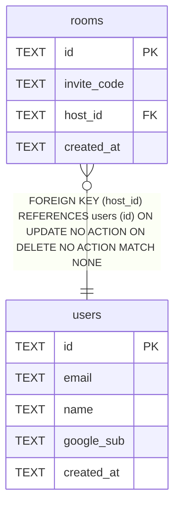

# D1 (lobby)

## Description

招待コード → ルーム解決のためのディレクトリ。ルームの中身（メンバー・付箋）の真実は RoomDO が持つため、ここには含まれない。RoomDO 側は .tbls/room-do.yml を参照。 D1 と RoomDO は物理的に別ストレージであり、DBレベルでの結合は存在しない。

## Tables

| Name | Columns | Comment | Type |
| ---- | ------- | ------- | ---- |
| [users](users.md) | 5 |  | table |
| [rooms](rooms.md) | 4 |  | table |

## Relations

---

> Generated by [tbls](https://github.com/k1LoW/tbls)
