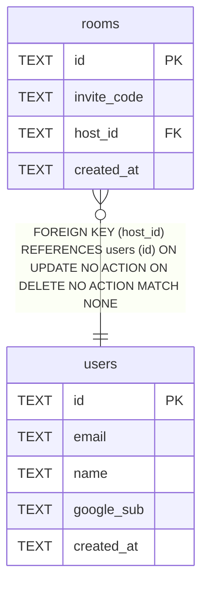

# rooms

## Description

<details>
<summary><strong>Table Definition</strong></summary>

```sql
CREATE TABLE rooms (
  id TEXT PRIMARY KEY,
  invite_code TEXT NOT NULL UNIQUE,
  host_id TEXT NOT NULL REFERENCES users (id),
  created_at TEXT NOT NULL DEFAULT (datetime('now'))
)
```

</details>

## Columns

| Name | Type | Default | Nullable | Children | Parents | Comment |
| ---- | ---- | ------- | -------- | -------- | ------- | ------- |
| id | TEXT |  | true |  |  |  |
| invite_code | TEXT |  | false |  |  |  |
| host_id | TEXT |  | false |  | [users](users.md) |  |
| created_at | TEXT | datetime('now') | false |  |  |  |

## Constraints

| Name | Type | Definition |
| ---- | ---- | ---------- |
| id | PRIMARY KEY | PRIMARY KEY (id) |
| - (Foreign key ID: 0) | FOREIGN KEY | FOREIGN KEY (host_id) REFERENCES users (id) ON UPDATE NO ACTION ON DELETE NO ACTION MATCH NONE |
| sqlite_autoindex_rooms_2 | UNIQUE | UNIQUE (invite_code) |
| sqlite_autoindex_rooms_1 | PRIMARY KEY | PRIMARY KEY (id) |

## Indexes

| Name | Definition |
| ---- | ---------- |
| rooms_host_id_idx | CREATE INDEX rooms_host_id_idx ON rooms (host_id) |
| sqlite_autoindex_rooms_2 | UNIQUE (invite_code) |
| sqlite_autoindex_rooms_1 | PRIMARY KEY (id) |

## Relations



---

> Generated by [tbls](https://github.com/k1LoW/tbls)
