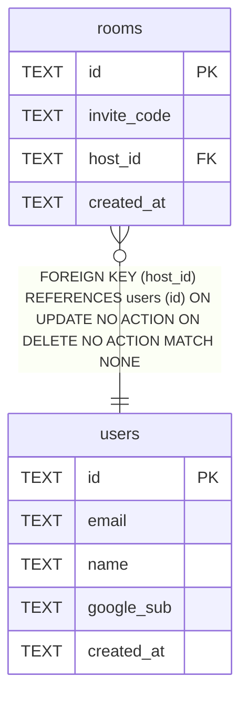

# users

## Description

<details>
<summary><strong>Table Definition</strong></summary>

```sql
CREATE TABLE users (
  id TEXT PRIMARY KEY,
  email TEXT NOT NULL UNIQUE,
  name TEXT,
  google_sub TEXT UNIQUE,
  created_at TEXT NOT NULL DEFAULT (datetime('now'))
)
```

</details>

## Columns

| Name | Type | Default | Nullable | Children | Parents | Comment |
| ---- | ---- | ------- | -------- | -------- | ------- | ------- |
| id | TEXT |  | true | [rooms](rooms.md) |  |  |
| email | TEXT |  | false |  |  |  |
| name | TEXT |  | true |  |  |  |
| google_sub | TEXT |  | true |  |  |  |
| created_at | TEXT | datetime('now') | false |  |  |  |

## Constraints

| Name | Type | Definition |
| ---- | ---- | ---------- |
| id | PRIMARY KEY | PRIMARY KEY (id) |
| sqlite_autoindex_users_3 | UNIQUE | UNIQUE (google_sub) |
| sqlite_autoindex_users_2 | UNIQUE | UNIQUE (email) |
| sqlite_autoindex_users_1 | PRIMARY KEY | PRIMARY KEY (id) |

## Indexes

| Name | Definition |
| ---- | ---------- |
| sqlite_autoindex_users_3 | UNIQUE (google_sub) |
| sqlite_autoindex_users_2 | UNIQUE (email) |
| sqlite_autoindex_users_1 | PRIMARY KEY (id) |

## Relations



---

> Generated by [tbls](https://github.com/k1LoW/tbls)
