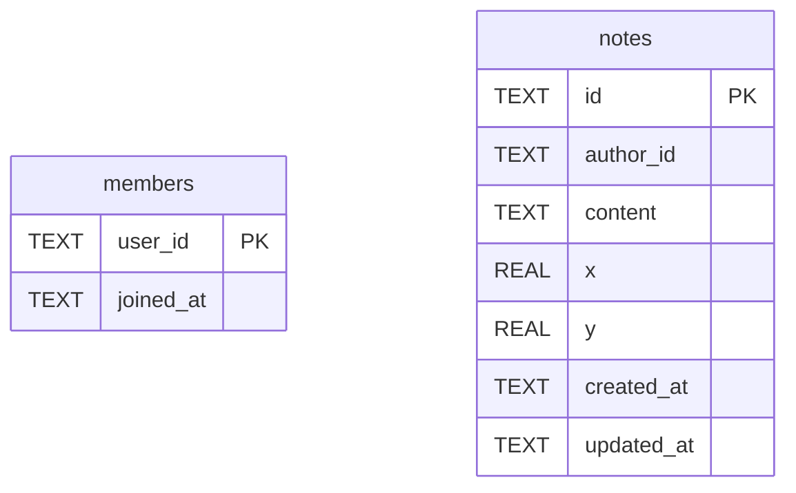

# RoomDO (room内部)

## Description

ルーム1つにつき1つ生成される SQLite-backed Durable Object の内部スキーマ。 メンバーシップと付箋の確定状態の真実をここで持つ。D1 の rooms.id はこの DO インスタンスに対応するが、DBレベルでの結合は存在しない（アプリケーション コード上でのみ対応づけられる）。D1 側は .tbls/d1.yml を参照。

## Tables

| Name | Columns | Comment | Type |
| ---- | ------- | ------- | ---- |
| [members](members.md) | 2 |  | table |
| [notes](notes.md) | 7 |  | table |

## Relations

---

> Generated by [tbls](https://github.com/k1LoW/tbls)
