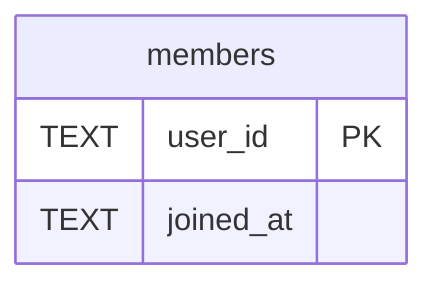

# members

## Description

<details>
<summary><strong>Table Definition</strong></summary>

```sql
CREATE TABLE members (
     user_id TEXT PRIMARY KEY,
     joined_at TEXT NOT NULL DEFAULT (datetime('now'))
   )
```

</details>

## Columns

| Name | Type | Default | Nullable | Children | Parents | Comment |
| ---- | ---- | ------- | -------- | -------- | ------- | ------- |
| user_id | TEXT |  | true |  |  |  |
| joined_at | TEXT | datetime('now') | false |  |  |  |

## Constraints

| Name | Type | Definition |
| ---- | ---- | ---------- |
| user_id | PRIMARY KEY | PRIMARY KEY (user_id) |
| sqlite_autoindex_members_1 | PRIMARY KEY | PRIMARY KEY (user_id) |

## Indexes

| Name | Definition |
| ---- | ---------- |
| sqlite_autoindex_members_1 | PRIMARY KEY (user_id) |

## Relations



---

> Generated by [tbls](https://github.com/k1LoW/tbls)
