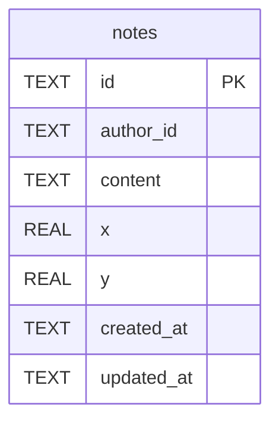

# notes

## Description

<details>
<summary><strong>Table Definition</strong></summary>

```sql
CREATE TABLE notes (
     id TEXT PRIMARY KEY,
     author_id TEXT NOT NULL,
     content TEXT NOT NULL DEFAULT '',
     x REAL NOT NULL,
     y REAL NOT NULL,
     created_at TEXT NOT NULL,
     updated_at TEXT NOT NULL
   )
```

</details>

## Columns

| Name | Type | Default | Nullable | Children | Parents | Comment |
| ---- | ---- | ------- | -------- | -------- | ------- | ------- |
| id | TEXT |  | true |  |  |  |
| author_id | TEXT |  | false |  |  |  |
| content | TEXT | '' | false |  |  |  |
| x | REAL |  | false |  |  |  |
| y | REAL |  | false |  |  |  |
| created_at | TEXT |  | false |  |  |  |
| updated_at | TEXT |  | false |  |  |  |

## Constraints

| Name | Type | Definition |
| ---- | ---- | ---------- |
| id | PRIMARY KEY | PRIMARY KEY (id) |
| sqlite_autoindex_notes_1 | PRIMARY KEY | PRIMARY KEY (id) |

## Indexes

| Name | Definition |
| ---- | ---------- |
| sqlite_autoindex_notes_1 | PRIMARY KEY (id) |

## Relations



---

> Generated by [tbls](https://github.com/k1LoW/tbls)
